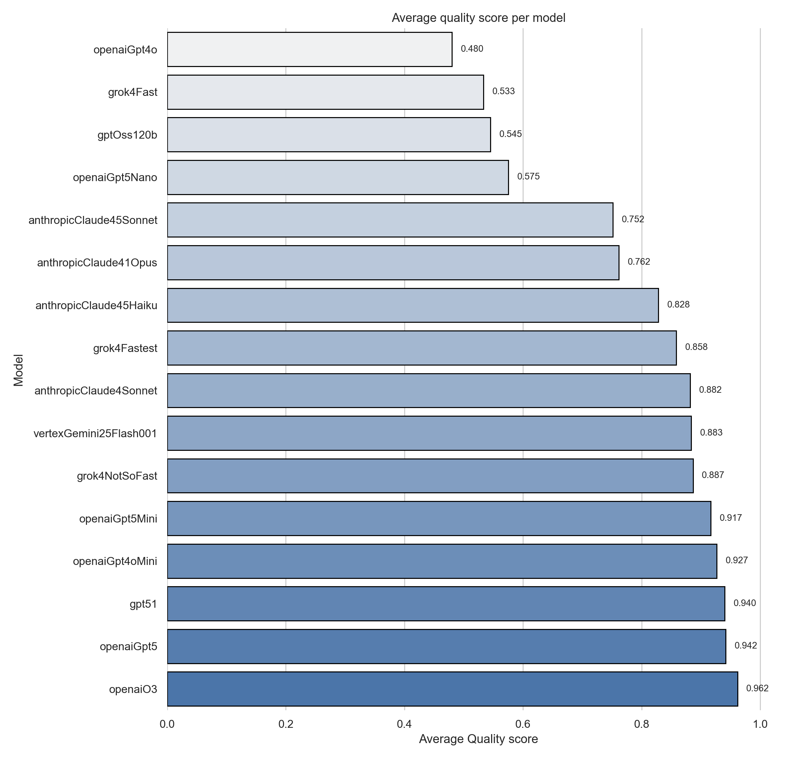
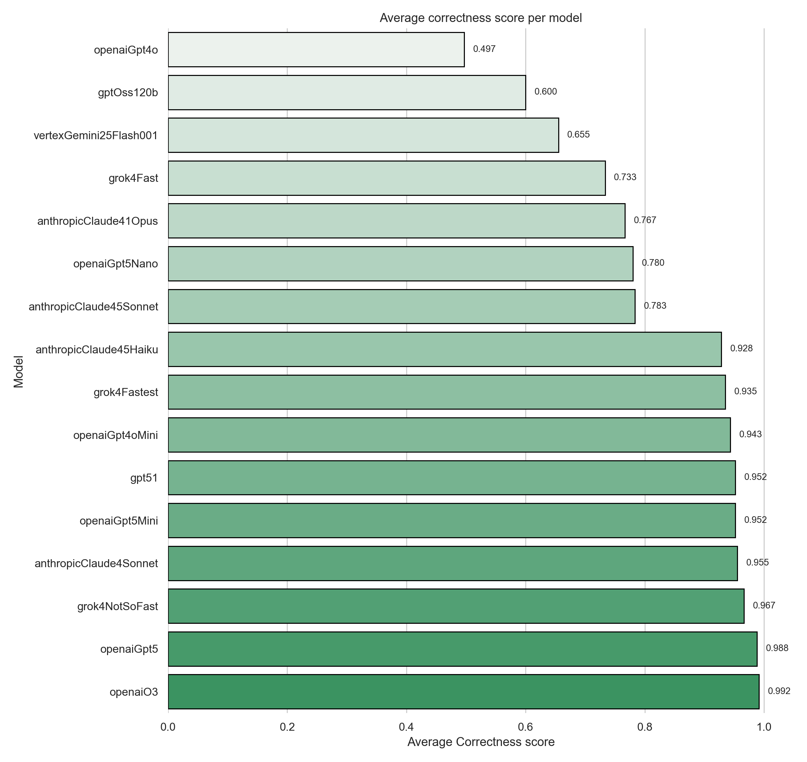
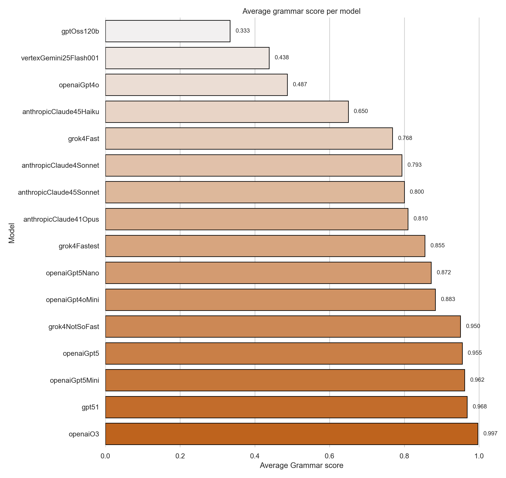
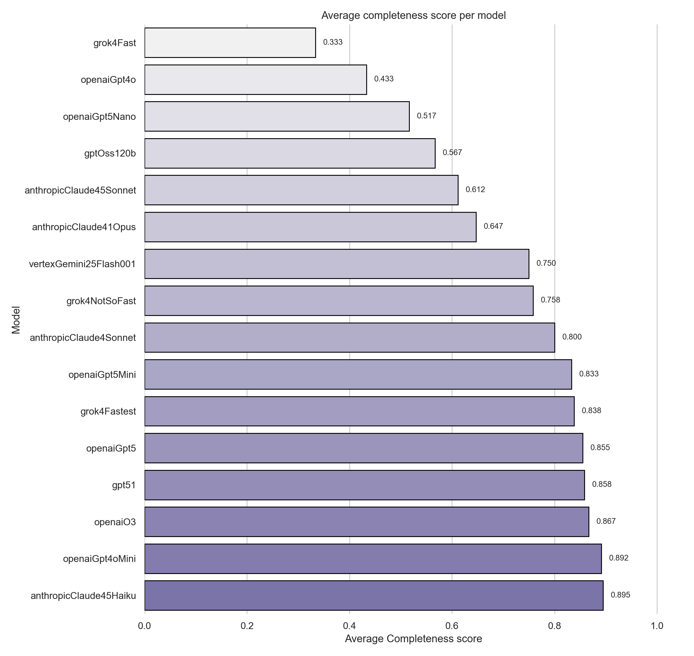
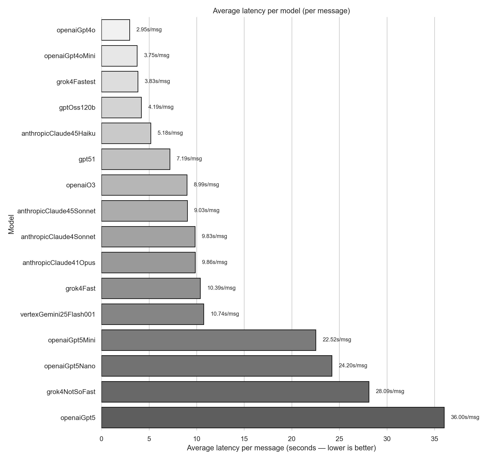

# Pompeu

A catalogue of LLMs (picked completely manually and with no particular reason) and how well they hold a Catalan conversation for common retail scenarios.

## Overview
- Source conversations live in `judgements/` (96 dialogues across 16 model variants).
- `uv run analysis` aggregates those judgements into tables and figures under `analysis/`.
- Outputs include machine-readable CSVs plus PNG charts ready for slide decks or reports.

## Running the analysis
```
uv run analysis
```

The command will install the required Python dependencies (pandas, seaborn, matplotlib), recompute every aggregate, and refresh the artefacts inside `analysis/`.

## Highlights from the latest run
- `openaiO3` tops the overall leaderboard (0.954), ahead of `openaiGpt5` (0.935) and `gpt51` (0.930).
- `openaiO3` also sets the pace for quality (0.962), correctness (0.992), and Catalan grammar accuracy (0.997).
- `anthropicClaude45Haiku` now leads completeness (0.895), narrowly beating `openaiGpt4oMini` (0.892).
- `openaiGpt4o` is the quickest responder at 2.949 seconds per message, comfortably ahead of the next-fastest model.
- Five models clear the 0.90 overall threshold, but completeness remains the key separator.
- Models with no recorded scores are omitted from the charts to keep the comparisons clean.

Key artefacts:
- `analysis/quality_avg_by_model.png` – bar chart of per-model average quality scores.
- `analysis/correctness_avg_by_model.png` – bar chart of per-model average correctness scores.
- `analysis/grammar_avg_by_model.png` – bar chart of per-model average grammar scores.
- `analysis/completeness_avg_by_model.png` – bar chart of per-model average completeness scores.
- `analysis/average_latency_by_model.png` – bar chart of per-model average latency per message (lower is better).
- `analysis/metrics_by_model.csv` – per-model averages ready for spreadsheet work.
- `analysis/judgements_flat.csv` – flattened row-per-judgement export if you want to slice further.

## Visuals










## Conclusion
`openaiO3` remains the overall benchmark thanks to its balanced performance across every metric, while it also delivers the best Catalan grammar scores in the study. For raw speed, `openaiGpt4o` leads the field with the lowest average per-message latency (2.949 seconds).

Re-run the analysis after dropping new JSON files into `judgements/` to keep the numbers fresh.
